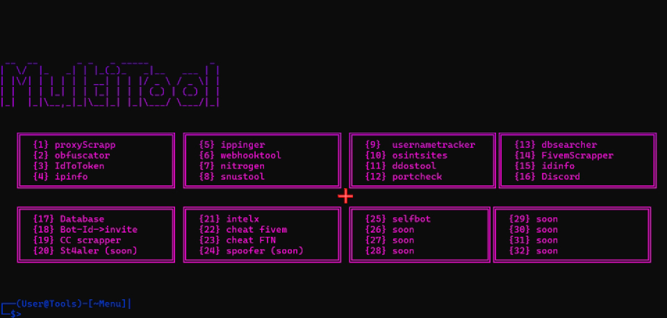

// MULTI TOOL - Par MCM //

1) Extraire le ".zip" sur son bureau
2) Mettre à jour le Tool
3) Exécutez "MultiTool.exe" et suivez les étapes

------------------------------------------------------------

// MULTI TOOL - By MCM //

1. Extract the ".zip" on your desktop
2. Update the Tool
3. Run "MultiTool.exe" and follow the steps

------------------------------------------------------------

------------------------------------------------------------